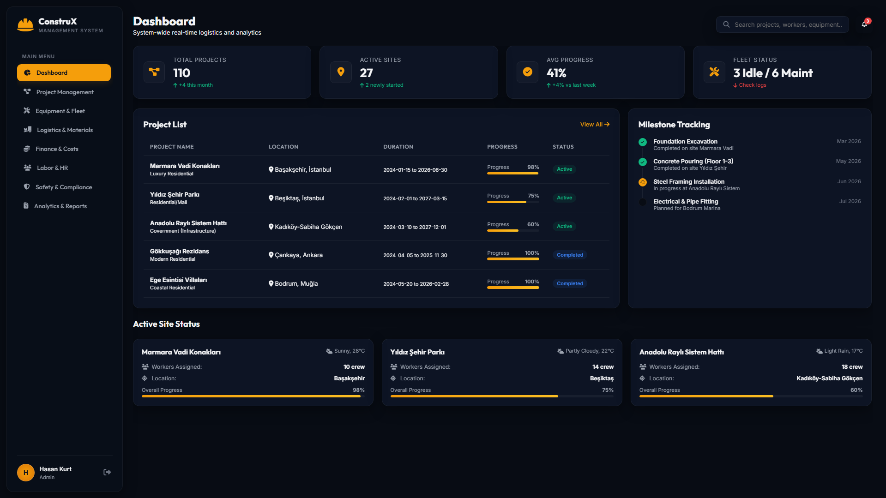
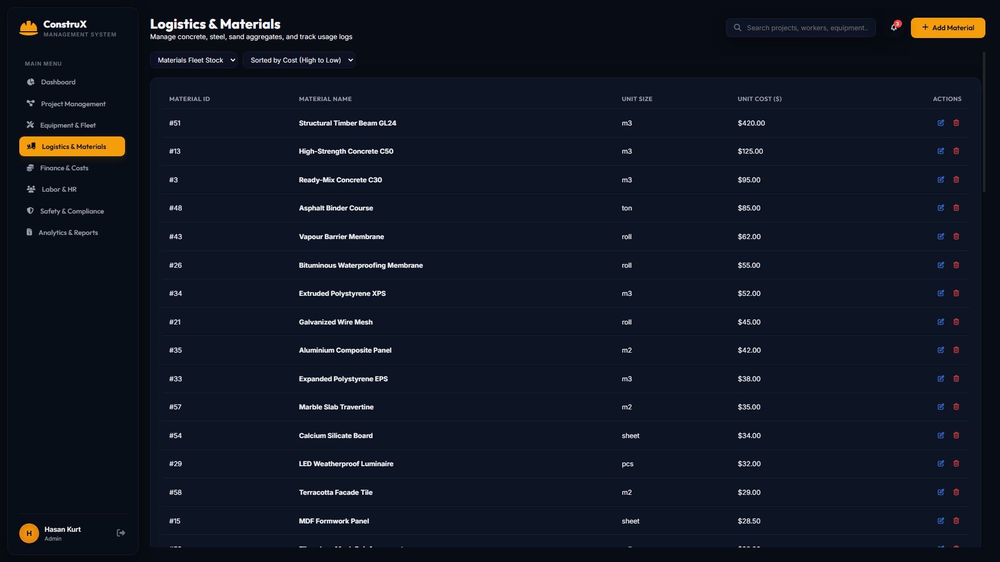
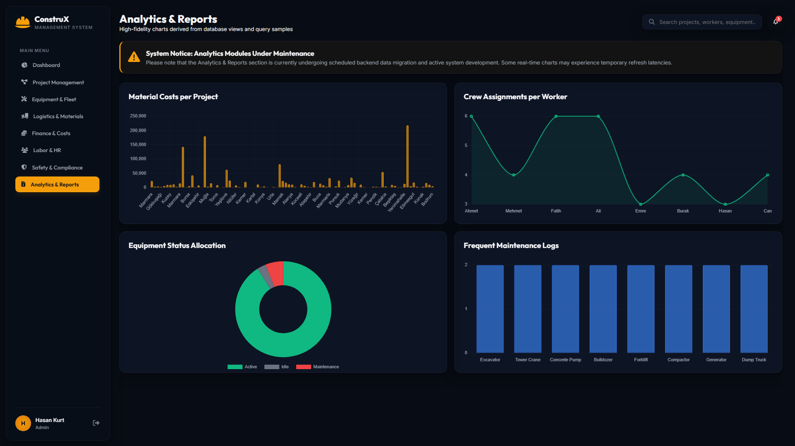
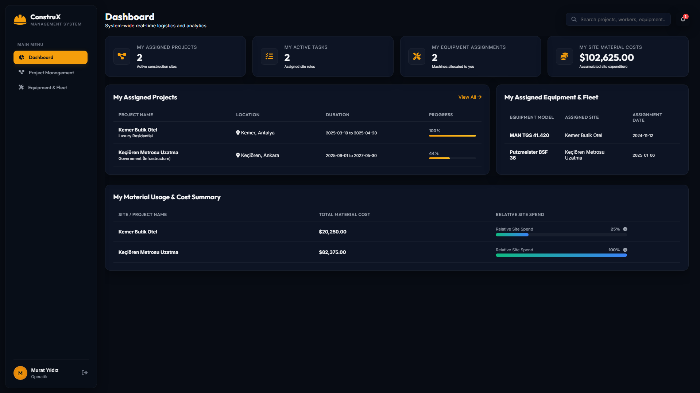

# ConstruX - Logistics & Construction Management System

This project is a relational database designed to manage the logistics of large-scale construction sites. The main goal is to solve the "information silo" problem where labor, equipment, and materials are tracked in different systems that don't talk to each other.

By centralizing everything into one SQL-based system, we can prevent common site errors—like scheduling a worker for a machine that is actually down for maintenance, or sending a crew to a site that doesn't have the necessary materials in stock yet.

VIDEO LINK:
https://drive.google.com/drive/folders/1Oo6Ik9uv9kBtGVjiH8iN1j9Ln829K7le
---

## The Problem
On most big job sites, data is a mess. Site managers use spreadsheets, maintenance crews use paper logs, and procurement uses different software. This leads to massive idle time and wasted money. ConstruX connects these pieces so you can see exactly who is working where, what machines they are using, and how much material is being consumed in real-time.

---

## Directory Structure
*   `/schema` -> Table structures and constraint definitions
*   `/data` -> Sample site data and seed scripts
*   `/queries` -> Reports, analytical SQL views, and trigger definitions
*   `/app` -> Application source code (C# Web API backend & Vanilla JS frontend)
*   `/docs` -> Project documentation, technical reports, and interface screenshots

---

## Database Structure

The project database is built around 7 core tables that keep the data clean, validated, and organized:

1.  **Sites**: Where the construction work is happening, tracking project names, locations, categories, and duration schedules.
2.  **Labor**: The company workforce roster, containing employee names, trade specialties (such as Operators, Welders, and Safety Auditors), hourly wage rates, and portal authentication credentials.
3.  **Equipment**: The heavy machinery fleet, documenting the type of machine, model specifications, and current status (`Active`, `Idle`, or `Maintenance`).
4.  **Materials**: The raw material catalog, keeping track of item names (e.g., steel, concrete), unit sizes, and unit costs.
5.  **Assignments**: The active allocations connecting sites, labor crew members, and specific machinery for selected dates.
6.  **Material Usage**: Logs recording quantities of raw materials consumed at specific construction sites on chosen calendar days.
7.  **Maintenance Logs**: Service records tracking repairs, checkups, and parts replacement for fleet machinery.

*Note: The SQLite schema also contains structure definitions for `purchase_orders` and `attendance` tables to support future logistics tracking expansions.*

---

## System Features & User Roles

ConstruX provides a role-based single-page application (SPA) frontend that adjusts its user interface depending on whether the authenticated user holds **Admin** or **Worker** privileges.

### 1.1 Administrator Portal Features
Administrators have full control over project data, resource assignments, and analytics:



*   **System Dashboard**: View site counts, average completion status, active site operations, and fleet logs in real-time.
*   **Project Management**: Full CRUD operations to add, modify, or delete construction site profiles.
*   **Equipment & Fleet Management**: Update fleet statuses, register new machinery, view historical service timelines, and review idle assets.
*   **Logistics & Material Stock**: Edit the material catalog, update unit pricing, record material usage logs, and sort catalog tables by unit cost.

    
*   **Labor & HR Controls**: Monitor the crew directory, update specialties, change wage rates, or grant administrative rights.
*   **Safety & Compliance**: Monitor assigned Safety Officers (`İş Güvenliği Denetçisi`) and trace safety compliance checklists across active projects.
*   **High-Fidelity Analytics Reports**: Interactive charts visualizing material costs per project, crew assignments per worker, fleet allocations, and frequent equipment maintenance categories.

    

### 1.2 Worker Portal Features
Crew members receive a personalized dashboard showing their active deployments:



*   **Personal Dashboard**: Quick overview tracking their active task assignments, allocated equipment, and project sites.
*   **My Projects & Tasks**: Interactive list indicating project schedules, locations, and progress tracking bars.
*   **My Fleet Allocation**: View specific machinery models assigned to them for active field shifts.
*   **My Site Cost Summary**: Graphic bars illustrating the relative material expenditures of the sites they are assigned to.
*   **Worker Profile Card**: Reference details indicating hourly wage, username, and user role.

---

## SQL Views & Triggers Description

Analytical queries, security boundaries, and validation checks are integrated into the database layer via SQL Views and Triggers.

### SQL Views (Located in `/queries/view.sql`)

*   **`site_overview`**: Joins site data, assignments, crew profiles, and machinery allocations. Used in the frontend assignments table and filtered in the C# API controller: Admins see all logs, whereas Workers are restricted to records containing their name.
*   **`site_material_cost`**: Aggregates total material costs per site by calculating the sum of quantities used multiplied by material unit costs. Used to build financial cost comparison charts in both Admin and Worker views.
*   **`equipment_maintenance_history`**: Flattens equipment descriptors together with their maintenance records. Used to feed the service log timeline.
*   **`idle_equipment`**: Filters equipment records to extract machinery with an `'Idle'` status. Used in the Admin resource assignment dropdown to present available options.

### SQL Triggers (Located in `/queries/view.sql`)

*   **`trg_prevent_double_assignment`**: An automatic database rule running `BEFORE INSERT ON assignments`. It checks if a piece of machinery is already booked on a given date. If a duplicate booking is attempted, SQLite aborts the transaction. The backend C# API controller intercepts this abort error and translates it into a standard JSON warning message.

---

## How to Run the Project

### Prerequisite Checklist
*   **SDK**: Install the **.NET 10 SDK** (or .NET 9 SDK).
*   **Runtime Environment**: Install **Python 3** (used to serve the frontend).

---

### Step 1: Start the Backend Web API

1.  Open your terminal and navigate to the API project folder:
    ```bash
    cd app/API
    ```
2.  Restore dependencies and build the server:
    ```bash
    dotnet build
    ```
3.  Run the API backend:
    ```bash
    dotnet run
    ```
    *The API will listen on `http://localhost:5182`. On the first run, the database (`construx.db`) is automatically generated and seeded.*

---

### Step 2: Start the Web Frontend

1.  Open a new terminal window and navigate to the frontend folder:
    ```bash
    cd app/web
    ```
2.  Launch Python's built-in web server:
    ```bash
    python -m http.server 8000
    ```
3.  Open your browser and go to:
    ```
    http://localhost:8000
    ```

---

### Step 3: Authenticating & Testing

You can sign in using sample profiles seeded in insert_data.sql:

#### Testing as Admin User:
*   **Username**: `ahmet.yilmaz`
*   **Password**: `ahmet123`
*   *(Gives administrative access to system analytics, HR databases, logistics, and fleet settings)*

#### Testing as Standard Worker User:
*   **Username**: `mehmet.kaya`
*   **Password**: `mehmet123`
*   *(Gives restricted access to Mehmet's assigned projects, assigned equipment, and personal dashboard)*
